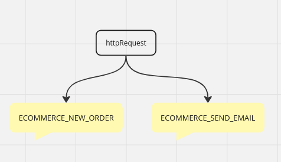
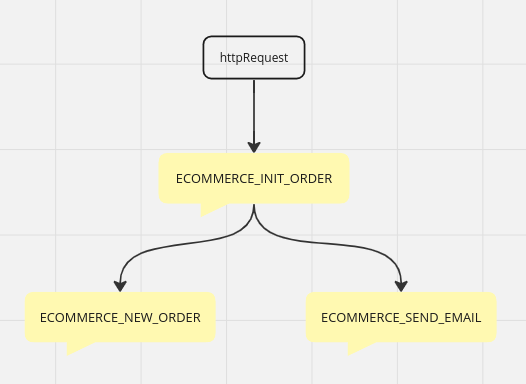

# Mensageria e Kafka
## Motivação geral do paradigma
### Exemplo: Sistema de Ecommerce (momento de realizar a compra online)
- Método monolítico/sequencial:
    - Requisição HTTP
    -> (thread 1) Email: compra em análise... -> verificação de pagamento.
- Método modular/paralela
    - Requisição HTTP
    -> (thread 1) SERVICE: Email de compra em análise...
    -> (thread 2) SERVICE: Verificação de pagamento

Se for inserido nesse sistema a implementação da feature de auditoria/log de cada etapa desse processo, se torna
ainda mais plausível o uso da modularidade, uma vez que cada etapa (email, pagamento, ...) vai chamar o processo
de criação de uma instância no log/registro de atividades.

## Como funciona
### Tópico
Cada serviço permanece "atento" ao tópico que diz respeito a sua execução, exemplo:
- (thread 1) SERVICE: Verificação de pagamento -> TRUE -> (send new message in TOPIC: pagamento_confirmado)
- (thread nova) SERVICE TRIGGERED "pag_confirmado": Reservar estoque

Ou seja, assim que a verificação de pagamento é finalizada, ele disponibiliza os dados dessa compra(mensagem) no tópico (pag_confirmado). Assim que um novo conteúdo é disponibilizado neste tópico, os serviços que o escuta são iniciados
se alimentando desses dados contidos no tópico.

### Broker
- Recebe as mensagens enviadas por qualquer serviço e os torna visíveis nos tópicos correspondentes
deste modo, iniciando cada serviço que está ouvindo mensagens deste tópico;

# Instalando kafka (Aula 1.2)
- Em kafka.apache.org, baixe o tar.gz da versão binária (código já buildado)
- Extraia o diretório do kafka e abra o terminal nele

## Configurando e iniciando o kafka
Dentro do root do diretório do kafka:
- Rodar o zookeeper com as configurações padrão 
    
    ```
    bin/zookeeper-server-start.sh config/zookeeper.properties
    ```
    Resultado: zookeeper em pé na porta 2181...

- Em outra aba, também no root do diretório kafka, agora rodar o kafka com configuração padrão
    
    ```
    bin/kafka-server-start.sh config/server.properties
    ```
    Resultado: kafka iniciado com sucesso, na porta 9092 (server.properties define)

## Usando o kafka
Agora com o zookeeper e o kafka rodando, criaremos um tópico para transitar mensagens:
- Criar tópico: 
    
    ```
    bin/kafka-topics.sh --create --bootstrap-server localhost:9092 --replication-factor 1 --partitions 1 --topic LOJA_NOVO_PEDIDO
    ```
    Resultado: tópico chamado LOJA_NOVO_PEDIDO criado, agregado ao kafka que está rodando na porta 9092 (replicant-factor e partitions iremos ver depois)

- Verificar tópico criado:
    
    ```
    bin/kafka-topics.sh --list --bootstrap-server localhost:9092
    ```
    Resultado: Exibirá o nome do tópico criado

- Criar um produtor para este tópico:
    
    ```
    bin/kafka-console-producer.sh --broker-list localhost:9092 --topic LOJA_NOVO_PEDIDO
    ```
    Resultado: o bash está preparado para receber as mensagens, conteúdos produzidos para este tópico

- Produzir algumas mensagens para este tópico:
    ```
    pedido0,550
    pedido1,330
    pedido2,67213
    ```

- Criar um consumidor para este tópico:
    ```
    bin/kafka-console-consumer.sh --bootstrap-server localhost:9092 --topic LOJA_NOVO_PEDIDO --from-beginning
    ```
    Resultado: Exibirá todas as mensagens criadas pelo produtor (a tag --from-beginning indica que enxergará todas as mensagens, desde o primeiro envio)

# Aplicando kafka em código

- Cria novo projeto maven
- Pesquisa dependência do kafka para maven 
```
    mvn kafka-clients
```
- Aplica dependência no ```pom.xml```
- Pesquisar dependência sf4j e aplica também

# Boas práticas
- É comum um mesmo produtor enviar mensagens em tópicos diferentes, entretando não é uma boa prática um mesmo consumidor escutar/receber mensagens de diferentes tópicos. Isso fere práticas SOLIDs

# Group e Partition
- Um grupo pode conter um ou mais consumidores. Se um grupo tiver dois consumidores, ambos ouvindo o mesmo tópico. Quando uma nova mensagem chega, esta será recebida apenas por um deles (o responsável pela partição em que a mensagem foi enviada) cada consumidor se encarregará de partições distintas (podendo um consumidor assumir uma ou mais partições).
Ex:
    - Tópico: TOPIC_1 (2 partitions);
    - Consumidores de TOPIC_1: cons1 (group1: partition0), cons2 (group1: partition1)
    - Mensagens enviadas no TOPIC_1: msg1 (partition0), msg2 (partition1)
    - msg1 <ins>capturado</ins> por cons1 (cons2 não terá acesso a essa mensagem)
    - value2 <ins>capturado</ins> por cons2 (cons1 nao terá acesso a essa mensagem)

Para que cons1 e cons2 acessem todas as mensagens de TOPIC_1, eles precisarão estar em groups diferentes.

- Alterando quantidade de Partitions de um tópico já existente:
```
    bin/kafka-topics.sh --alter --zookeeper localhost:2181 --topic ECOMMERCE_NEW_ORDER --partitions 3
```
OBS: 2181 - zookeeper port

# Partitions e Keys
Como visto inicialmente, cada mensagem contém chave e valor. Para ser definido em qual partição a mensagem vai ser enviada, leva-se em conta a chave dessa mensagem. Ou seja, se a chave sempre for igual, a mensagem sempre será enviada para a mesma partição.

# Produtores consumidores
Um consumidor pode, após receber a mensagem do tópico inscrito, criar uma nova mensagem e enviar em algum novo tópico.


# Enviando mensagens via requisição HTTP
- Criar módulo novo com dependência do jetty aplicadaç
- Inicia um servidor com o jetty, lidar com requisições enquanto o servidor estiver de pé
- Configura uma url que, quando chamada, dispara uma nova compra (realiza o dispatcher)
- Habilitar a URL para receber os parâmetros da compra, através do uso do httpServletRequest

Atenção, é uma boa prática executar o mínimo de processos possíveis, antes de enviar uma mensagem, quando utilizar servletHTTP, pois o acúmulo de código torna o servidor passível de crashar. Tenha em mente enviar a primeira mensagem e disparar em cascata as chamadas de outros processos, encarragados por outras mensagens, pois se alguma falha ocorrer nesse meio, é mais fácil lidar com isso, uma vez que, em algum lugar, existe uma mensagem com os dados antes da falha ter ocorrido.

Inapropriado:S


Apropriado


# Cluster de brokers
Assim como os services "kafkaconsumers" são resilientes, ou seja, podemos rodar várias cópias/réplicas de uma vez e, caso uma delas fique fora do ar, as demais vão rebalancear as partições para assumir as que, até então, pertenciam ao serviço caído, precisamos desse tipo de resiliência para os brokers, que enviam as mensagens.

- Definir um novo server properties, que representará o novo broker:
    ```
    cp config/server.properties config/server2.properties
    ```
- Com essa cópia criada, precisa-se distinguí-la da anterior:
    - Definir *broker.id* diferente
    - Definir diretório de logs *logs.dir* diferente
    - Definir *listener=PLAINTEXT://:* diferente

- Levantar server2:
    ```
    bin/kafka-server-start.sh config/server.properties
    ```

- Alterar tópico para ser replicado no novo broker *replication factor*:
    ```
    bin/kafka-topics.sh --zookeeper localhost:2181 --alter --topic ECOMMERCE_NEW_ORDER --partition 3 --replication-factor 2 
    ```

- Inserir replication default para cada server properties:
    - *dfault.replication.factor=* (não existe, precisa ser escrito dentro do properties)
- Parar execução de todos os services e brokers (zookeeper e kafka server)
Agora, cada tópico tem réplicas em dois brokers, um lider e um réplica;


